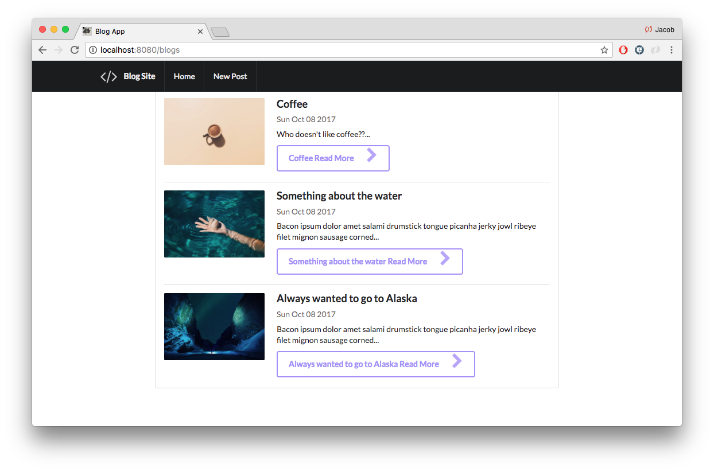

# RESTful Blog

## Overview

This is your bread and butter CRUD application. The application is a blog where users can upload an title, description and image to the blog. The blog post can be edited and deleted.

## Technology

-- Application built with Node and EJS --
 - Uses Node and Express in the background and EJS in the front
 - The database used for this application is MongoDb
 - The styling is done with CSS and Semantic UI

## Home Page

